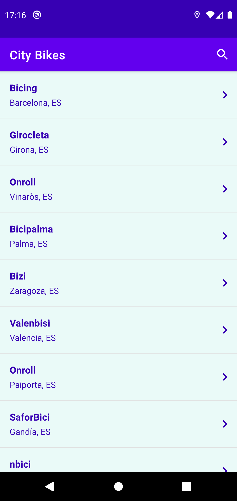
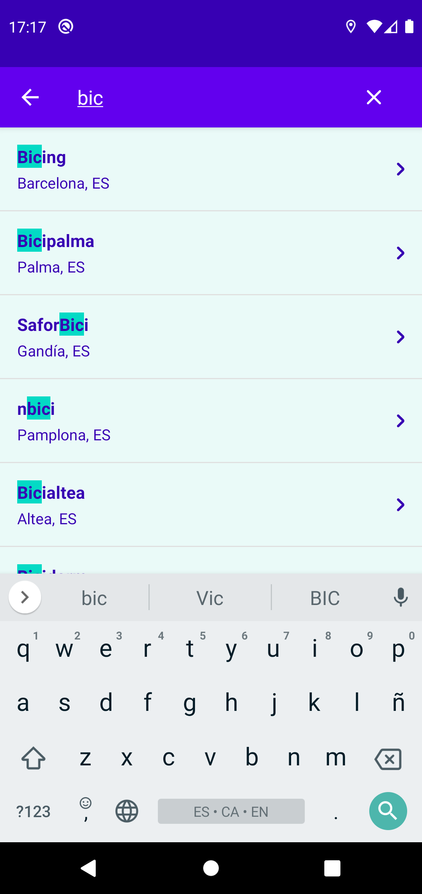
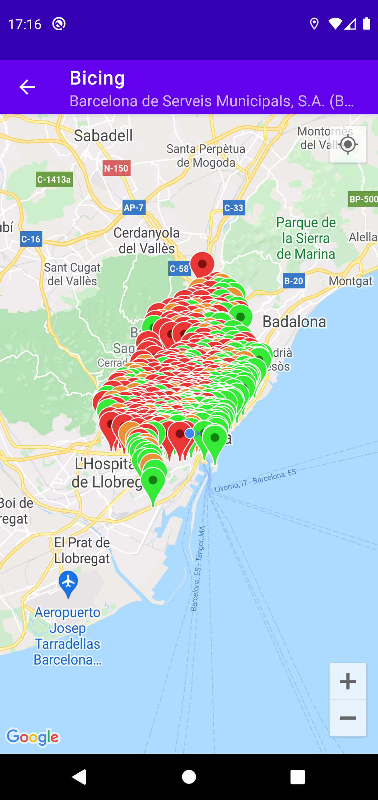
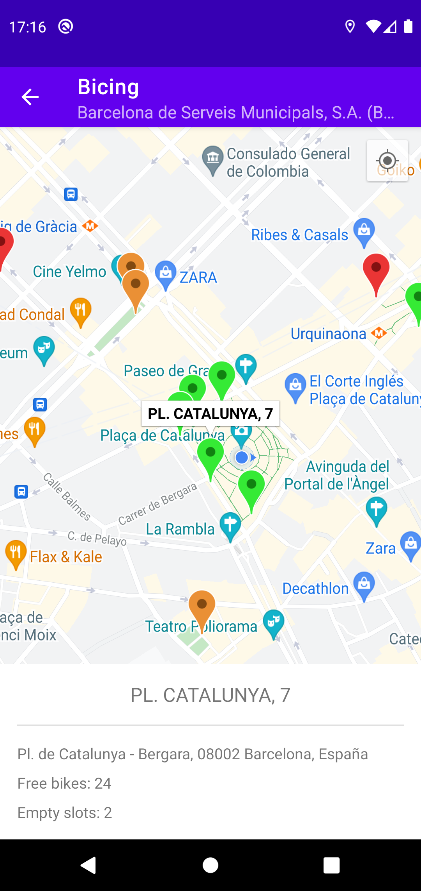

# City Bikes

Repository to show architecture, testing and some android technologies.

Networks list        | Filtered networks list      | Network map         | Detail of station
-------------------- | --------------------------- | ------------------- | ----------------------
 |  |  | 

### Architecture
- Clean architecture
- MVI

### Testing
- TDD
- Mockito
- PowerMock
- MockWebServer

### Technologies
- Retrofit & OkHttp
- RxAndroid
- Dagger2
- ViewModel & Livedata
- Google maps
- Shimmer

[CityBikes API](http://api.citybik.es/v2/)
